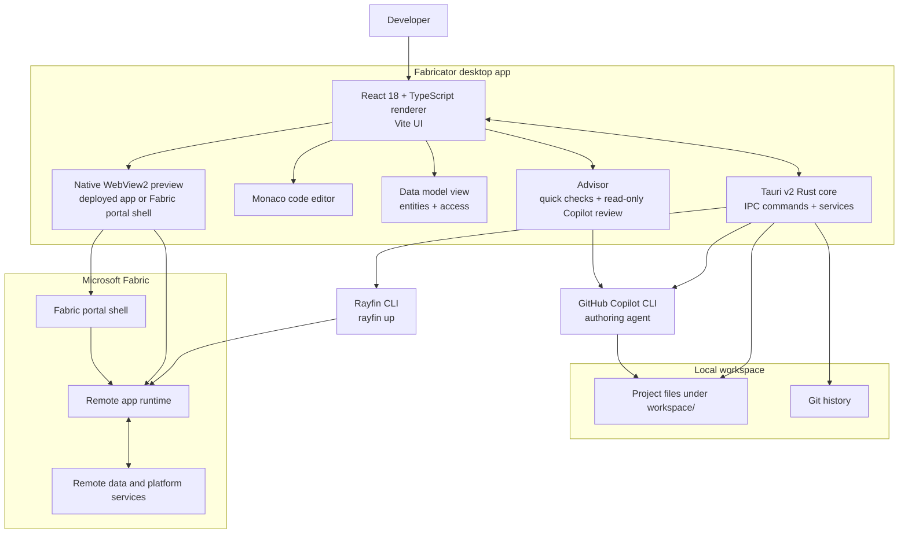

<div align="center">
  

  <h1>Fabricator</h1>

  <p><strong>The all-in-one workbench for building Rayfin apps — chat to build, preview inline, and ship to Microsoft Fabric, all in one window. No CLI wrangling, no new account: just your GitHub Copilot sign-in.</strong></p>

  <p>
    <a href="https://github.com/spatney/rayfin-fabricator/releases/latest"></a>
  </p>

  <p>
    <a href="./LICENSE"></a>
    
    
  </p>
</div>

<div align="center">
  <a href="https://github.com/spatney/rayfin-fabricator/releases/latest">
    
  </a>
  <p><sub>Build, preview, and ship — all in one window. <em>(Representative UI.)</em></sub></p>
</div>

> **Personal project disclaimer**
> Fabricator is a personal project built by Sachin Patney in his own free time. The author works at Microsoft, but this is not a Microsoft product and is not affiliated with, endorsed by, sponsored by, or supported by Microsoft.

Building a Rayfin app usually means living in your terminal: scaffold with one CLI, prompt the Copilot CLI, run `rayfin up` to deploy, wrangle git, flip to a browser to check it, repeat. Fabricator folds all of that into a single desktop app.

You chat, the app gets built, you watch it come together inline, and you manage every deployment from one panel. No commands to memorize, no terminal tabs to juggle.

Best of all, it runs on the **GitHub Copilot account you already have**. Nothing new to sign up for and no extra subscription — sign in and start building.

### New to Rayfin?

Rayfin is Microsoft's **Backend-as-a-Service for the agentic era**. You define your data model with TypeScript decorators and the platform provisions and manages the database, authentication, data APIs, storage, and hosting for you — all on Microsoft Fabric, with enterprise-grade governance built in. Learn more at [microsoft/rayfin](https://github.com/microsoft/rayfin) and the [Rayfin docs](https://aka.ms/rayfin/docs).

Fabricator is the desktop shell that makes building those apps effortless.

## Everything in one window

1. **Chat to build.** Describe what you want in plain English. The built-in GitHub Copilot agent writes and edits the project files for you — you never touch a command line. Git quietly snapshots every change, so you can diff and roll back anytime.
2. **See it as it's built.** Inspect and edit any file in a built-in Monaco editor, and watch the app itself in a live inline preview — no separate browser, no copy-pasting URLs.
3. **Deploy with a click.** Hit deploy and Fabricator runs `rayfin up` for you, shipping the app to Microsoft Fabric. Create, switch, and redeploy across workspaces from a single deployments panel — then share the app with teammates in your tenant straight from that panel.
4. **Harden it.** The Advisor grades your app's health and lists what needs attention. Instant checks run as you work, and an on-demand, read-only Copilot review digs deeper. Every finding shows the exact lines, why it matters, and a one-click fix.
5. **Repeat** until it's exactly what you wanted.

## Download

Fabricator runs on **Windows 10/11** and **macOS (Apple Silicon)**.

> **[⬇️ Download the latest release](https://github.com/spatney/rayfin-fabricator/releases/latest)**

**Windows**

1. Grab the `Rayfin Fabricator_<version>_x64-setup.exe` asset from the [latest release](https://github.com/spatney/rayfin-fabricator/releases/latest), or browse every build on the [Releases](https://github.com/spatney/rayfin-fabricator/releases) page.
2. Run it. The installer is Authenticode code-signed (via Azure Artifact Signing) and shows a verified publisher, *Sachin Patney*. SmartScreen reputation builds per certificate over time, so an early download may still warn you — if it does, choose **More info → Run anyway**.

**macOS (Apple Silicon)**

1. Grab the `Rayfin Fabricator_<version>_aarch64.dmg` asset from the [latest release](https://github.com/spatney/rayfin-fabricator/releases/latest), open it, and drag the app into **Applications**.
2. The macOS build is ad-hoc signed but not yet notarized by Apple, so macOS quarantines it on download. Clear the quarantine flag once from Terminal, then open the app normally:

   ```bash
   xattr -dr com.apple.quarantine "/Applications/Rayfin Fabricator.app"
   ```

   > This is a one-time step. Without it macOS may report the app as *"damaged and can't be opened"* — that's the quarantine flag, not real corruption. (Control-click → **Open** also works, but the `xattr` command is the most reliable.) These steps go away once the app is notarized.

Then launch the app. The onboarding doctor checks the rest and walks you through signing in to GitHub Copilot and Azure. Sign in to Microsoft Fabric when you open a project and deploy.

To build apps you'll create a Rayfin project with `npm create @microsoft/rayfin@latest`. Fabricator uses that project's pinned Rayfin CLI, so there's nothing to install globally. The app keeps itself up to date with in-app auto-updates on both platforms.

Want to build from source instead? Jump to [Build from source](#build-from-source).

### Sign-in and recovery

Copilot ships with Fabricator; you do not need a separate global Copilot installation or a terminal login. Setup verifies authentication and model access through the same bundled engine that runs chat, rather than trusting a remembered username. Complete the browser or device-code instructions shown in the app. A failed or timed-out check stays unverified and displays a reason.

For **GitHub Enterprise Cloud with data residency**, enter your enterprise hostname, such as `company.ghe.com` or `https://company.ghe.com`, in **GitHub host** before signing in. Leave it as `github.com` for a standard GitHub account. The selected host is used to request the device code, so use the verification URL shown by that sign-in attempt; a code issued by `github.com` cannot be redeemed on an enterprise host. The last successfully used host is remembered for setup and chat recovery. GitHub Enterprise Server hosts are not supported by this Copilot login flow.

If Copilot credentials expire while you are working, use **Sign in to Copilot** in chat, then retry your message. Sign-in refreshes the engine and available models without clearing your conversation or unsent draft. Missing Copilot sessions are reconnected when possible; if the saved engine session is gone, Fabricator explains that it has started a new one and keeps the displayed chat history. Prompts are not automatically replayed after work has started.

Use **Sign out** on the GitHub Copilot or Azure CLI account card in setup to remove that provider's stored sign-in and re-check readiness. Copilot sign-out removes the current Copilot account without deleting conversations; Azure sign-out uses `az logout`. These credentials are shared with the respective CLIs, not the separate Fabric or preview-browser session. Copilot credentials supplied by environment variables or GitHub CLI must be removed at their source; Fabricator reports those cases rather than pretending to sign out or clearing another tool's credentials. If another remembered Copilot account becomes active, its connection is shown after the re-check.

Fabric and Azure checks also verify usable credentials, and the GitHub repository picker verifies the active GitHub identity through its API. Sign-in failures are shown in the app rather than silently continuing; expired credentials and permission failures are handled separately. Signing in does not automatically replay sharing or deletion operations.

If deployment repeatedly fails even though Fabric sign-in appears successful, open **View deploy logs** in the preview's error banner; the logs remain available even when an older deployment is still live. Use **Refresh Fabric authentication** in that banner or in the account menu (your avatar at the top right; when signed out, the arrow beside **Sign in to Fabric**) to confirm a credential reset. Fabricator runs the selected project's `rayfin logout`, then `rayfin login`, and verifies the new credential against Fabric. Rayfin owns stale-lock cleanup; Fabricator never deletes token-cache files itself. The reset affects the shared Rayfin CLI session, not Copilot, Azure CLI, or the preview browser, and keeps your project, conversation, and drafts open. Failed logout or sign-in stops recovery and shows the reason; after a successful refresh, use **Redeploy** to retry explicitly. Build, network, and permission failures do not automatically clear credentials.

The bundled Universal App starter and its capability packs require Rayfin **1.36.2 or newer**, including its stale token-cache lock recovery and the item-name deploys team workspaces use. Existing projects keep their pinned dependencies: use the **Rayfin** version control in the status bar and **Update with Copilot** to upgrade their CLI and SDK together.

The app preview's browser sign-in is separate from Fabricator's Fabric CLI session. If silent token acquisition needs interaction, the semantic-model dialog offers **Sign in & retry** rather than repeatedly retrying without credentials.

On Windows, startup and **Re-check** refresh CLI discovery from the saved user/machine PATH and common Scoop/pnpm locations. If a CLI is found but its version check fails, setup shows the failure and offers **Re-check** instead of installing another copy. **GitHub CLI (gh)** is optional repository tooling; it is separate from the bundled Copilot engine, so a pnpm Copilot installation does not satisfy the `gh` check.

## What's inside

**Author.** Chat with a built-in GitHub Copilot agent — pick the model and reasoning effort, steer it mid-turn, and keep separate threads (plus optional parallel side threads) with full history. Ordinary messages run in **Agent** mode. Plans proposed in chat support review, revision, approval, and recovery, with **Autopilot** execution when offered. Inspect and edit any generated file in a built-in Monaco editor, see your data model as an entity diagram, browse the agent's reusable Skills, and lean on a git timeline you can diff and restore.

**New project** asks only for a name. Every app starts from the bundled Universal App, a small starter that grows into whatever you describe; there's no template to pick. To begin from a ready-made app instead, choose **Start from a community example** (the awesome-rayfin gallery or any template URL). Fabricator checks as you type that the name isn't already a folder in your projects folder (or an app in the chosen team workspace). Before a project's first deploy into a workspace, it warns if that workspace already has an app with the same name, because `rayfin up` would replace it; deploying there anyway takes an explicit **Replace it anyway**.

The chat keeps the agent's answer front and center. While a turn runs, its steps stream into a live work log: files read, searches, commands with their latest output, and edits. You can also see the model's reasoning as it thinks, when the model shares it. When the turn finishes, the log folds into a single "Worked for 2m · 23 steps" line you can expand. Expanding it shows each step, including the exact command a step ran and a line-by-line diff of every edit. Each answer ends with chips for the files it changed. Click one to see what the turn changed in that file as a single diff, even when the agent edited it several times; **Open** takes you to the file in the Code tab. File paths mentioned in an answer open in the Code tab directly. Hover a message to see its time and copy it. The latest answer also offers **Try again**, which re-runs your last message as a fresh attempt. That re-run keeps the conversation's context and the files the previous attempt changed. **New chat** clears the conversation after asking you to confirm; it doesn't touch your app's files.

The git timeline compares saved versions with the current working files, including staged edits and new files. Team-app history and file paths are scoped to that app rather than the whole workspace repository.

**Ship.** One-click `rayfin up` deploys to Microsoft Fabric. A deployments panel handles create, switch, and redeploy across workspaces — and share a deployed app with people in your Entra tenant by email (each recipient gets Contributor on its workspace, and any semantic model the app uses in another workspace is automatically shared with Build access).

After a successful chat turn, Fabricator automatically redeploys changes since the last deployed revision, including edits the agent has already committed. Unchanged content does not trigger another deploy. If the deployed revision is unknown (for example, after switching to another deployment), the next successful turn deploys once to establish a baseline. Failed or cancelled turns do not auto-deploy; if checking for changes fails, Fabricator shows an error with guidance to use **Redeploy**.

**Preview.** A native inline preview loads your running app — navigation, reload, browser devtools (inspector), focus mode, a Fabric portal shell toggle, and **Design**, which lets you point at your app to change it (below).

While Copilot works, Fabricator automatically runs the project's locally installed Vite so frontend edits show live. No setting or npm `dev` script is required. The local frontend uses the existing Fabric deployment's configuration; it does not start a local Fabric backend. At turn end, the normal deployed preview and automatic deployment take over (team previews remain local until their pipeline deployment is ready). If every sign-in-compatible port is busy, Fabricator lets you register another port, explicitly stop the process it identifies, or skip live preview for that turn. Projects without local Vite keep the deployed preview.

The native preview follows the renderer's display scale and browser/pinch zoom, including moves between monitors. Creation, positioning, and visibility commands stay ordered so a slow-starting preview cannot leave an old surface over the chat or other tabs.

### Design

Choose **Design** in the preview toolbar, then click anything in your deployed app, either the direct view or the one embedded in Fabric. A card opens beside the element. Type what should change, or pick one of the suggestions for that kind of element. You can also change it directly:

- **Quick tweaks.** Edit text, pick a text or background color from your app's own palettes, step the size or spacing, or set corners, shadow, weight and alignment. You can also hide the element or move it among its siblings. Hover a swatch or choice to preview it; click to keep it. Tweaks are recorded in your app's Tailwind vocabulary, for example `text-sm → text-lg`.
- **Charts.** Change a Graphein chart's type, palette, legend, sort, orientation, title and value format, and see it update live.
- **Options.** Ask a fast model for three alternative looks for the element. Hover one to preview it; click to apply it. Your typed text guides the options.
- **All like this.** Apply a change to every element that looks the same.

Everything previews live in the app, and each element gets one numbered change that you can undo or remove. **Theme** tries a new accent, neutral colors, corner radius, density or font across the whole app, and a light/dark preview if your app has both. **✦ Polish** runs a quick design review of the page. It suggests fixes such as low contrast, small tap targets or inconsistent corners, which you can preview and add. The Desktop, Tablet and Phone buttons change the preview width.

Queued changes appear as chips in the chat composer, so you can review them, open one again, or drop one. Press **Send** in the composer or the Design bar to send them all as one request. Anything you type becomes a note. Fabricator attaches a screenshot of the previewed result, a crop of each changed element, and the likely source locations. Your message shows a Design card instead of the raw instructions; expand **Details sent to Copilot** to see exactly what went out. Copilot then edits the source, and the usual automatic redeploy shows the real result. **Try again** and **Retry** re-send the same changes.

### Validation and maintenance

**Validate.** The Advisor is a health dashboard for your app. It shows a letter grade, a strip with one block for every check, an issues list whose rows open in place, and a checklist for each area: access and sign-in, data policies, secrets, data model, queries, configuration, Rayfin versions and platform, performance, and accessibility. Opening an area lists every rule it checks, with Copilot's note on why each one passed. Its 80-plus rules are written for Rayfin 1.35.1 and link to the matching rayfin.ai pages, and they include checks that the Rayfin CLI and SDK are on the latest release and in lockstep. Quick checks run on their own whenever the project changes and don't use Copilot. **Run deep review** starts a read-only Copilot review for the rules that need judgment. It can read your project and rayfin.ai, but it can't edit files, run commands, or open `.env` files. While it runs, a live line shows what Copilot is reading, the strip fills in as results arrive, and issues appear as soon as they're confirmed. Each issue shows the flagged lines, why it matters, and how to fix it.

Send a finding, or a selection, to Copilot with **Fix**. Quick checks re-run when the fix lands; for review findings, **Verify** re-checks just that issue. Dismiss a false positive or an accepted risk, or mute a rule for the app. Findings marked New or Resolved show what changed since the last review. The grade stays provisional until a deep review is current, and the badge on the Advisor tab counts open high- and medium-severity issues. The Model tab flags loose access on any entity and hands a one-click *harden* prompt to the agent.

**Stay current.** Fabricator tracks each project's pinned Rayfin version and can hand an upgrade straight to the agent, keeping the app building as it goes.

### Team workspaces (experimental)

Turn on **Team workspaces** in Settings → Experiments to build apps with your team the way developer teams do, without setting anything up by hand. A team workspace is a private GitHub repository that holds your team's apps, one folder per app. A pipeline in that repository deploys the apps to Microsoft Fabric. It signs in with the workspace's own deploy identities (Entra ID service principals), so apps are never deployed from someone's laptop.

- **Create a workspace** from Home → Team workspaces. Name it, then pick the GitHub owner (you or an organization) and a Fabric capacity. Fabricator does the rest:
  - It creates the private repository, plus two Fabric workspaces: one for published apps and one for everyone's previews.
  - It creates two deploy identities and lets the repository's pipeline sign in as them through GitHub OIDC. No secret is stored anywhere.
    - **Pull requests** can only sign in as the preview identity, which can only reach the previews workspace. So changing the pipeline in a pull request can't touch published apps.
    - **Publishing** (pushes to `main`) uses the deploy identity.
  - It adds the pipeline, then runs it once to check it can reach Fabric.

  If a step needs an administrator, Fabricator explains why and gives you instructions to send them. For example, your organization may not let you register apps, or a Fabric admin may have turned off service principal access. Setup then resumes where it stopped. An app registration an administrator provides is used for both previews and published apps.
- **Invite teammates** by GitHub username from the workspace **Overview**: select the workspace (or **Manage**), then **Members**. Add their work email to give them access to the apps in Fabric. They accept the invitation from their own Home, which lists only invitations to team workspaces. Owners see everyone who can open the apps under **App access** and can remove anyone's access; removing a member also removes the access given to them.
- **Work on an app.** Opening an app puts it on your own working branch. While Copilot works, the preview runs the app on this computer, so changes show up as they're made. It uses your preview's data, or the published app's data (labelled **Local · published data**) until your first preview is deployed. After each chat turn, Fabricator saves the changes to GitHub, and the pipeline deploys your personal preview. The app bar shows it deploying with a progress line, and so does the preview: a progress bar above the page, or, before your first preview exists, the step it's on. The preview switches to the deployed version once it's live. If the local preview stops responding (for example after a package install), Fabricator starts it again. Switch to the published app from the team menu in the header. When teammates publish changes to the same app, **Bring in their changes** merges them. If you both changed the same files, Copilot can combine them.
- **See everything** in the workspace **Overview**, from Home or the overview button in the header. It's a map built around the apps. Each app sits in the middle: on its left, its published version and everyone's working copies, with what each changes and how its preview is deploying; on its right, what the app has (its own database and tables, file storage, functions and connectors), and beyond that what those connect to: semantic models, warehouses, lakehouses and other Fabric items, and the services functions reach. A source several apps use appears once, and what someone's working copy adds, changes or removes is marked with their name. Hover anything to light up what it's connected to, and select a working copy to read its changes file by file. The sidebar shows what the pipeline is deploying and the two Fabric workspaces it deploys to. Select the members in the header (or **Manage**, or the gear on Home) for the workspace's members, app access and settings; owners remove an app from the app's details.
- **Publish** saves your work, brings in teammates' changes, and checks that your preview deploys. If the workspace requires reviews, it waits for a teammate's approval; approvals are given from Home. Fabricator then merges your changes, and the pipeline deploys the published app. If a data-model change would delete data, the pipeline stops and asks you to confirm.
- **Move an existing app** into a workspace from Manage project. The app needs Rayfin 1.36.2 or newer; update older apps first with **Update with Copilot**. The team copy deploys as a new app; data in its old deployment isn't copied.

Prerequisites:
- The GitHub CLI (`gh`), signed in with the `repo`, `read:org` and `workflow` permissions. Fabricator asks for these.
- An Azure CLI sign-in that can register apps in Microsoft Entra ID. This is the default for members of a tenant; otherwise you need the Application Developer role or an administrator.
- Access to a Fabric capacity.
- The Fabric tenant setting *Service principals can call Fabric public APIs*. It's on by default.
- Rayfin 1.36.2 or newer in each app. New apps start there. The pipeline stops with a clear message for older apps; update them from the status bar.

On GitHub Free, private repositories can't use branch protection, so Fabricator follows the publish flow itself. Members with write access could still push to `main` on GitHub directly; a paid plan lets GitHub enforce the flow and required reviews. Team workspaces support github.com only. When a new Fabricator version updates the workspace's pipeline, the Overview's **Manage → Settings** shows it; **Repair** installs it. Turning the experiment off hides team workspaces and their apps without deleting anything.

## Architecture



A React renderer drives the workbench, chat, editor, data model view, preview, deployments, advisor, settings, skills, and history. A Tauri v2 Rust core owns the IPC handlers in `src-tauri/src/commands/` and the services in `src-tauri/src/services/` for running external tools, persistence, preview hosting, telemetry, history, crash logs, auto-updates, and path management.

The idea: Fabricator wraps the tools you'd otherwise run by hand. It shells out to the GitHub Copilot CLI to author and to the Rayfin CLI to deploy, tracks your project with git, and loads the running app — deployed to Microsoft Fabric — into the embedded preview. The Advisor closes the loop: instant rule checks plus an on-demand, read-only Copilot review flag issues like unguarded routes, loose database policies, or unbounded text columns, and it tells you when a review has gone stale. You get the whole build-and-ship loop without leaving the window.

## Build from source

You'll need:

| Requirement | Notes |
| --- | --- |
| Windows 10/11 or macOS | Windows uses the WebView2 runtime (the in-app doctor checks it); macOS uses the system WebKit. macOS builds target Apple Silicon (arm64). |
| Node.js 20+ and npm | For the renderer and build scripts. |
| Rust stable | Windows: the MSVC toolchain. macOS: the default toolchain plus the Xcode command-line tools. |
| Tauri prerequisites | For local desktop development and packaging. |
| Git | Used for local project history. |
| Rayfin CLI | Ships with each Rayfin project (`npm create @microsoft/rayfin@latest`); Fabricator runs the project-pinned version via `npx rayfin`. Sign in to Microsoft Fabric in-app. |
| GitHub Copilot CLI | Bundled by the Rust SDK; sign in through Fabricator. No global install is required. |

Clone, install, and run:

```bash
git clone https://github.com/spatney/rayfin-fabricator.git
cd rayfin-fabricator
npm install
npm run dev
```

Build the desktop app and platform installer (NSIS `.exe` on Windows, `.dmg` + updater bundle on macOS):

```bash
npm run build
```

Sanity-check the project-local Rayfin CLI before deploying or previewing:

```bash
npx rayfin --help
```

Scripts worth knowing:

| Script | What it does |
| --- | --- |
| `npm run dev` | Run the app in development mode (Tauri + Vite). |
| `npm run build` | Build the desktop app and installer. |
| `npm run dev:renderer` | Run the Vite renderer on its own. |
| `npm run build:renderer` | Build the Vite renderer on its own. |
| `npm run typecheck` | Type-check the Node and web TypeScript projects. |
| `npm test` | Run renderer regression tests (also run in CI). |
| `npm run lint` | Run ESLint. |
| `npm run format` | Format renderer source with Prettier. |

## Project layout

```text
rayfin-fabricator/
├─ src-tauri/                 Rust Tauri backend, IPC commands, services, resources, packaging
│  ├─ src/commands/           IPC handlers: advisor, auth, chat, deploy, doctor, files, git, projects, settings, threads, …
│  ├─ src/services/           exec, preview, store, telemetry, history, crashlog, emit, paths
│  └─ vendor/wry/             Vendored wry: WebView2 device-compliance SSO patch + macOS preview-positioning fix
├─ src/renderer/              React 18 + TypeScript UI built with Vite
│  ├─ screens/                SetupScreen onboarding and Workbench shell
│  └─ components/             ChatPanel, PreviewPane, CodeViewer, DeploymentsControl, AdvisorView, GitControl, SettingsModal, …
├─ src/shared/ipc.ts          Shared TypeScript IPC types
├─ src/shared/advisor/        Advisor rule catalog (rules.json), shared by the renderer and the Rust core
├─ docs/                      Maintainer deployment notes and the vendored wry patch write-up
├─ analytics/                 Application Insights KQL queries and notes
├─ resources/                 Runtime resources, including telemetry configuration placeholders
├─ .github/workflows/         Release workflow: Windows (NSIS) and macOS (dmg) builds
├─ package.json               npm scripts and renderer dependencies
└─ logo.png                   Project logo
```

The vendored `wry` patch is documented in [`docs/VENDORED-WRY-PATCH.md`](./docs/VENDORED-WRY-PATCH.md). It enables WebView2 device-compliance SSO so the embedded preview can sign in to Entra Conditional Access "compliant device" apps.

## Telemetry & privacy

Telemetry is optional and stays off unless a connection string is present.

- Official release builds can inject `resources/telemetry.json`; `resources/telemetry.example.json` is a zeroed placeholder.
- Local development builds send nothing by default.
- Events are coarse product signals like `signin`, `deploy`, and (for the Team workspaces experiment) `team` with only the action and whether it succeeded — nothing more.
- User and tenant identifiers are SHA-256 hashes of the email or email domain; raw emails are never sent.
- A salt ships in the binary and is explicitly not treated as a secret.

Maintainer provisioning lives in [`docs/DEPLOY.md`](./docs/DEPLOY.md).

## Contributing

Contributions are welcome. Read [`CONTRIBUTING.md`](./CONTRIBUTING.md) and follow the [`CODE_OF_CONDUCT.md`](./CODE_OF_CONDUCT.md).

## Security

Report security issues per [`SECURITY.md`](./SECURITY.md). Please don't open public issues for sensitive reports.

## License

Fabricator is released under the [MIT License](./LICENSE).

## Disclaimer

This is a personal project built by [Sachin Patney](https://github.com/spatney) in his own free time. The author works at Microsoft, but Fabricator is not a Microsoft product and is not affiliated with, endorsed by, sponsored by, or supported by Microsoft.
