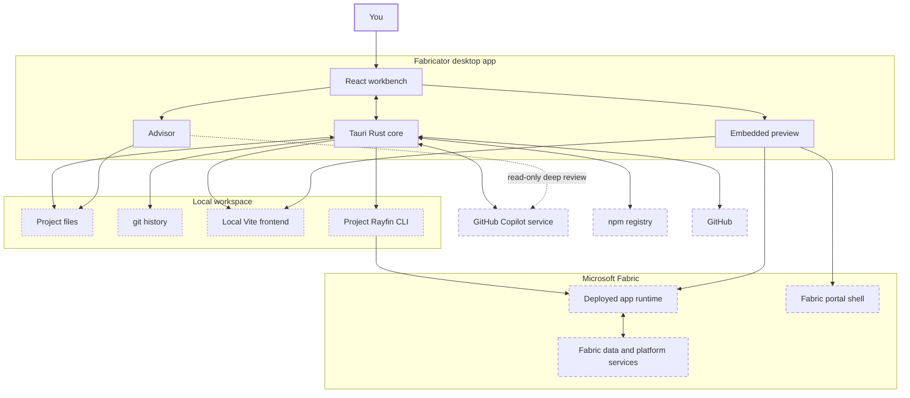

Fabricator wraps the tools you would otherwise run by hand. You describe the app, the built-in GitHub Copilot agent edits a local Rayfin project, Fabricator previews the result, and Rayfin deploys it to Microsoft Fabric.

## The loop

1. You create, open, or clone a Rayfin project.
2. You type a request in chat.
3. The bundled Copilot engine reads and edits files in the project folder.
4. Fabricator records changes with git so you can inspect diffs and history.
5. Fabricator starts the project's local Vite frontend during chat turns when the project has Vite installed.
6. Fabricator runs the project-pinned Rayfin CLI for deploys.
7. The preview shows the deployed app, the Fabric portal shell, or the local frontend while Copilot is working.
8. The Advisor runs quick checks locally and can start a read-only Copilot review.

## Main pieces

| Piece | Where it runs | What it does |
| --- | --- | --- |
| Desktop UI | Your computer | The React workbench, chat, editor, preview, settings, history, skills, deployments, and Advisor views. |
| Tauri core | Your computer | The Rust layer that runs commands, stores app state, manages paths, handles diagnostics, hosts previews, and talks to native plugins. |
| GitHub Copilot engine | Bundled with Fabricator, connected to GitHub Copilot | The agent that reads and edits your app when you chat. |
| Project Rayfin CLI | Your project, through `npx rayfin` | Deploys the app and manages Fabric sign-in through the project's pinned Rayfin version. |
| git | Your project folder | Tracks local history, diffs, restores, and team workspace branches. |
| Local Vite preview | Your computer | Shows frontend edits during chat turns when the project has Vite installed. It uses the existing Fabric backend configuration. |
| Microsoft Fabric | Your tenant | Hosts deployed app runtimes, data, Fabric workspaces, capacities, and Fabric app items. |

## Architecture diagram

## What runs on your computer

Fabricator stores settings, project lists, chat history, Advisor state, logs, diagnostics exports, and npm cache files under the app data folder. Your Rayfin apps live in the workspace folder, which defaults to `RayfinProjects` in your home directory. See [Files and folders](/docs/reference/files).

The desktop app uses Tauri v2: a Rust core with a React renderer. On Windows, the embedded preview uses WebView2. On macOS, it uses the system web view.

## What goes over the network

Fabricator and the tools it runs can contact these services:

- GitHub Copilot for chat, model access, design options, and deep Advisor reviews.
- Microsoft Fabric and Rayfin services when you sign in, deploy, preview deployed apps, share apps, or inspect Fabric items.
- GitHub for update checks, release downloads, cloning repositories, issue reporting, and team workspace repositories.
- The npm registry when scaffolding or installing project dependencies, unless the bundled warm cache already satisfies the install.
- Azure and GitHub APIs for team workspace setup when the **Team workspaces** experiment is enabled.

## What the Advisor can read

Quick checks run locally against the project snapshot. **Run deep review** starts a read-only Copilot review. That review can read your project and rayfin.ai documentation, but it is not allowed to edit files, run commands, or open `.env` files.
